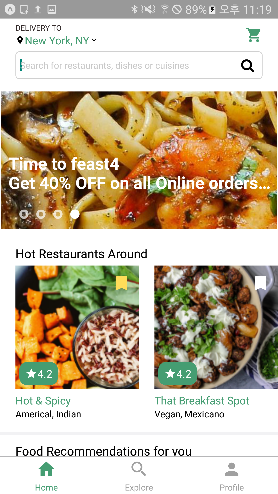
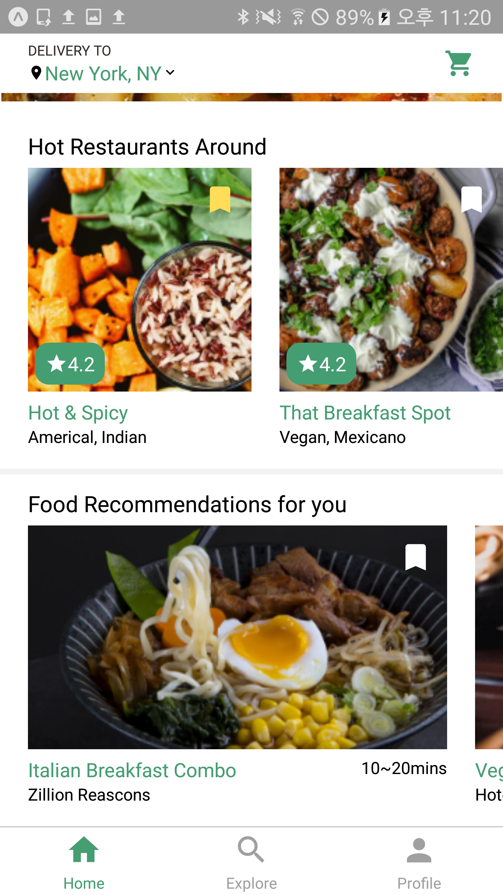
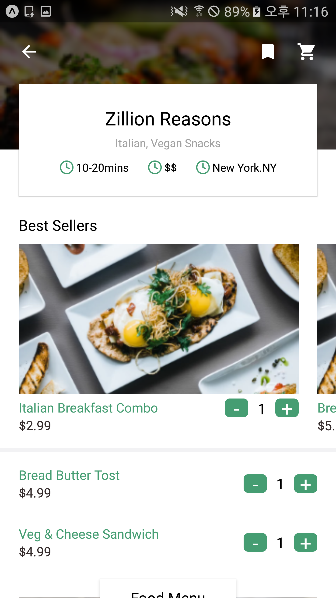
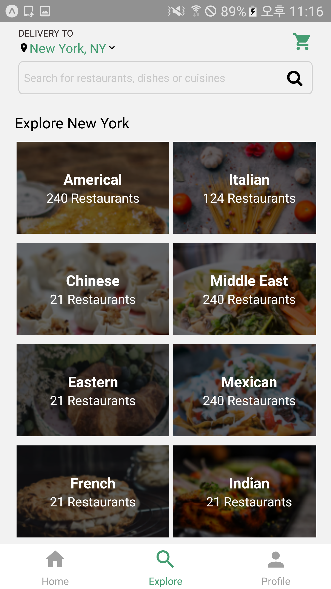
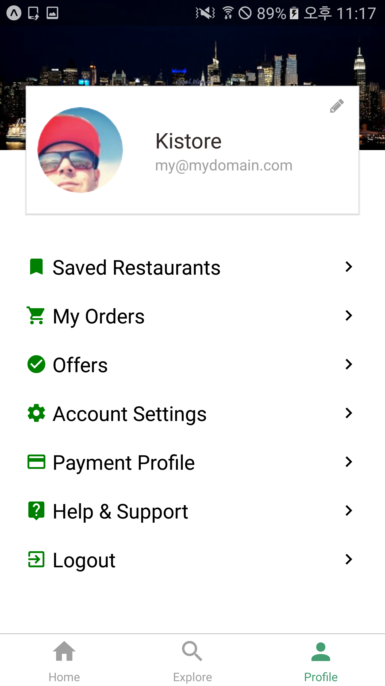

# neko-restaurant
- React Native with expo, Front UI
- React Navigation 4.x
- https://reactnavigation.org/docs/getting-started

# Install
- yarn add react-navigation react-navigation-stack react-navigation-tabs

- expo install react-native-gesture-handler react-native-reanimated react-native-screens react-native-safe-area-context @react-native-community/masked-view

- yarn add react-native-snap-carousel

# Designed by 
- https://project365.design/

# Capture screens
|Home|Home (scrolled)|Restaurant|Explore|Profile|
|:---:|:---:|:---:|:---:|:---:|
||||||